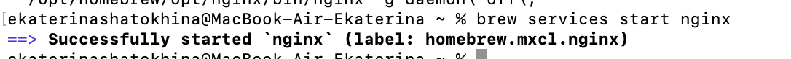
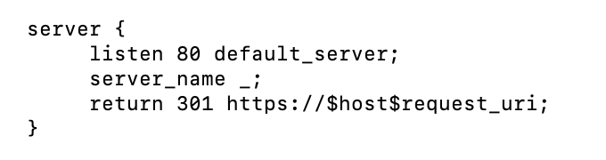

**Лабораторная работа 1**  
Обычная 

**Цель:**   
Настроить nginx по заданному тз:

1. Должен работать по https c сертификатом  
2. Настроить принудительное перенаправление HTTP-запросов (порт 80\) на HTTPS (порт 443\) для обеспечения безопасного соединения.  
3. Использовать alias для создания псевдонимов путей к файлам или каталогам на сервере.  
4. Настроить виртуальные хосты для обслуживания нескольких доменных имен на одном сервере.  
5. Что угодно еще под требования проекта

Результат: Предположим, что у вас есть два пет проекта на одном сервере, которые должны быть доступны по https. Настроенный вами веб сервер умеет работать по https, относить нужный запрос к нужному проекту, переопределять пути исходя из требований пет проектов.

**Ход работы:**

Чтобы настроить nginx, его нужно установить. Устанавливаем nginx на macOS с помощью утилиты brew (brew install nginx). После установки запускаем команду brew services start nginx и видим, что все успешно.   
  
 
Чтобы сервер мог подключаться по https, нужно создать самоподписанные сертификаты. Для этого через brew устанавливаем openssl. Если бы мы заказывали сертификаты за деньги, нам бы подписали их в центре сертификации, тогда к нашему сайту по https могли подключаться другие люди. Но нам для других не нужно, поэтому создадим собственный центр сертификации ROOT CA: корневой сертификат root\_ca.cert и ключ root\_ca.key с помощью команды:   

	Вводим пароль, который потом будет использоваться для подписи сертификатов через этот центр сертификации. Далее генерируем сертификат уже для самого сайта (основное доменное имя localhost, поэтому и файл называется так же). Команда:   

После выполнения команды был создан приватный (секретный) ключ, но в этом ключе нет вообще никакой дополнительной информации, в секретном ключе хранятся исключительно 2048 случайных бит. В таком виде его нельзя подписать, поэтому нам надо создать специальный файл localhost.ext с таким содержимым:  
*authorityKeyIdentifier=keyid,issuer*  
*basicConstraints=CA:FALSE*  
*subjectAltName=@alt\_names*  
*\[alt\_names\]*  
*DNS.1=localhost*  
*IP.1=127.0.0.1*  
*IP.2=192.168.0.10*  
	Следующей командой просим центр сертификации подписать  ключ localhost.key:  

Подписываем со стороны центра сертификации: 
	  
Также в приложении Apple Configurator нужно добавить профиль нашего центра, потому что иначе компьютер ему не доверяет и не разрешает подключиться по https. После этого редактируем файл nginx.conf. Меняем порт подключения и вставляем ссылки на сертификат и ключ. 

Пробуем подключиться по адресу [https://localhost:443](https://localhost:443).   
 
	Осталось перенаправить трафик http на https для безопасного подключения. Для этого добавим в конфиг блок сервера, который будет слушать 80 порт и все оттуда отправлять на https.   

	Радуемся и чувствуем себя senior devops. 

	Далее нужно написать сервер, который будет слушать запросы по https (порт 443\) и выполнять роль прокси-сервера \- то есть в зависимости от того, что написано в адресной строке, перенаправлять запрос к нужному пет проекту (их у нас два \- pr1 и pr2). Проекты написаны на Flask, один из них запущен на порту 5000, другой \- 5001\.   

Возвращаемся к файлу nginx.conf, к серверу, который слушает 443 порт. В server\_name вписываем адрес pr1.localhost и в директиве location прописываем proxy\_pass на нужный нам порт для первого проекта \- 127.0.0.1:5000. 

	Аналогично работает другой сервер, написанный для второго проекта.    

	Также в обоих серверах прописали alias \- это псевдонимы путей (чтобы не писать каждый раз длинный путь, а писать одно слово). Теперь наши проекты смогут получить доступ к файлам, находящимся в директории static (первый проект) и media (второй проект).   
	

Теперь в зависимости от запроса в адресной строке у нас открываются разные проекты:

 

