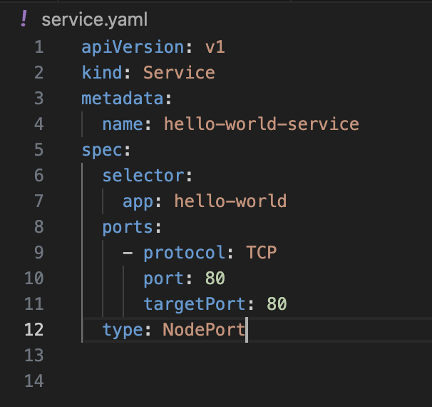
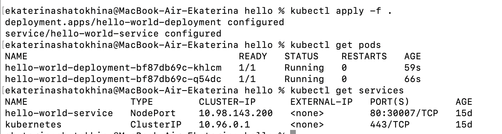
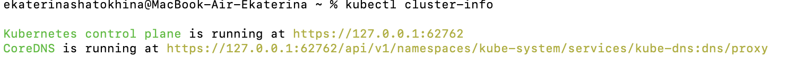
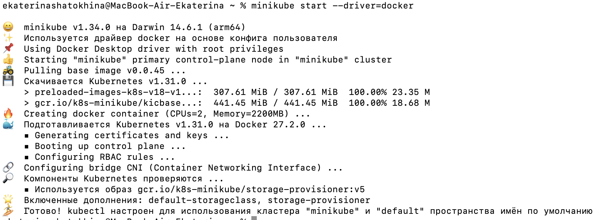
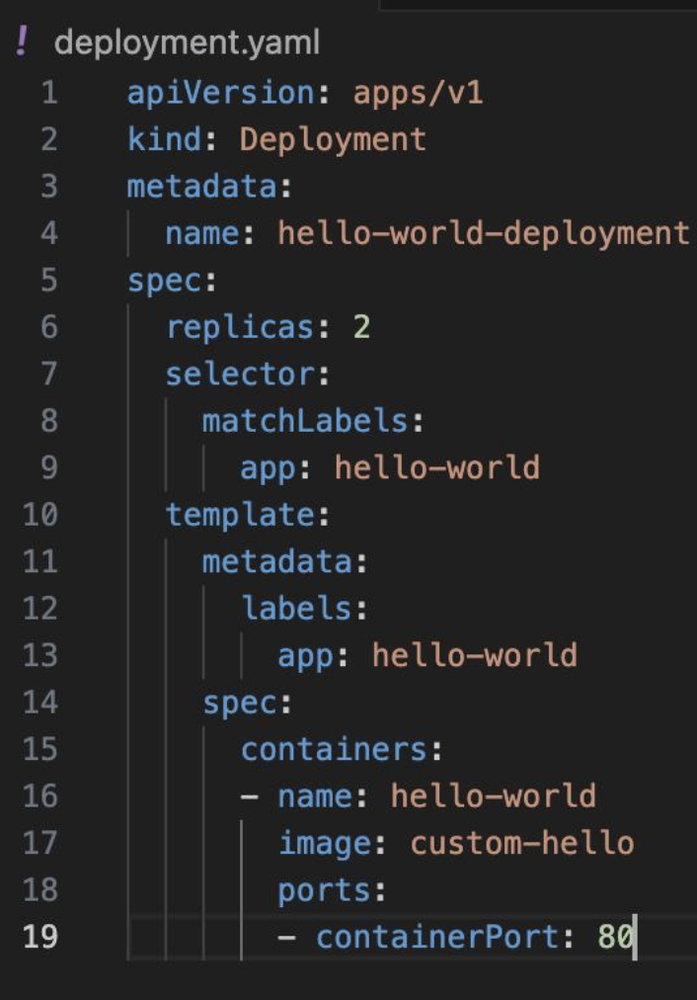
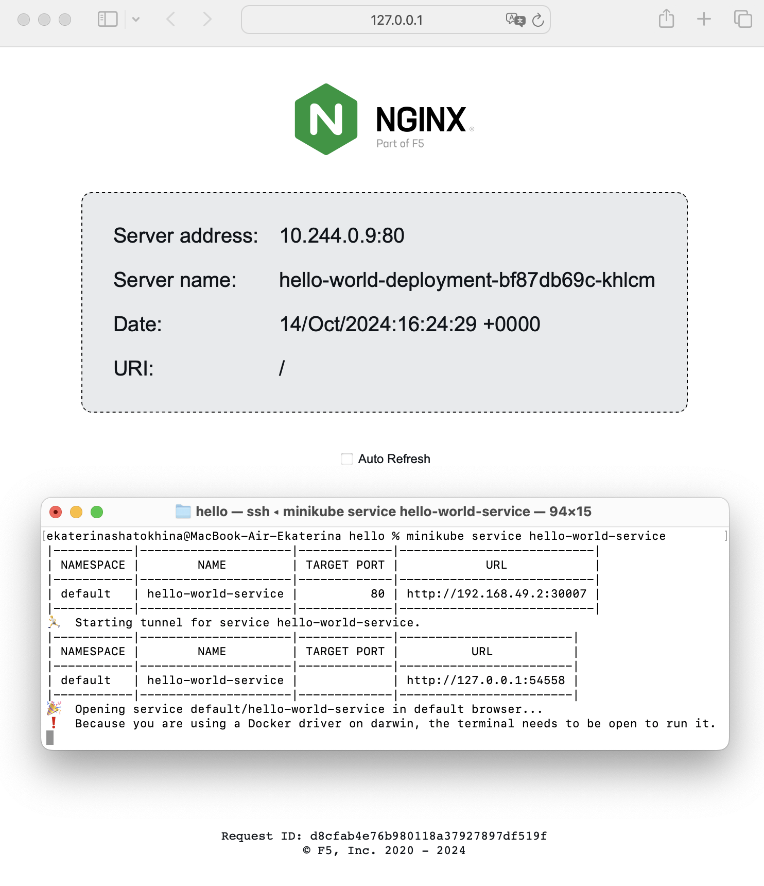
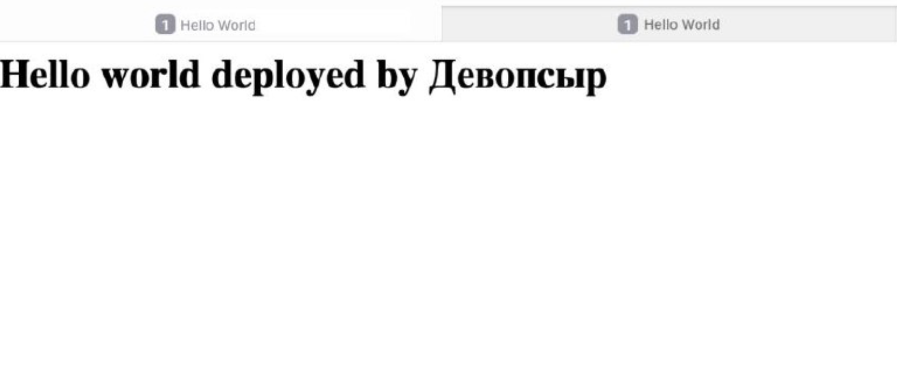

**Лабораторная работа 3**  
Обычная 

**Цель:** 

1. Поднять kubernetes кластер локально (например minikube), в нём развернуть свой сервис, используя 2-3 ресурса kubernetes. В идеале разворачивать кодом из yaml файлов одной командой запуска. Показать работоспособность сервиса.

2. Прочитать шикарную книжку про жирафа: [Kubernetes\_for\_Kids\_ITSummaPress (1).pdf](https://drive.google.com/file/d/1Sm3EslfGtSaKZCZwnZ_8BZGmFiPC13Qp/view?usp=sharing)

**Ход работы**

	Книжка прочитана, устройство кубера понято и обсуждено с коллегами-разработчиками на работе.   
	Для выполнения задания нужно установить kubernetes и minikube, сделаем это с помощью brew. Запускаем brew install minikube и brew install kubectl. Для Minicube требуется драйвер, один из самых популярных \- VirtualBoх, однако он не работает на Apple Silicon, поэтому используем Docker. Устанавливаем и запускаем его, а затем запускаем команду minicube start \--driver=docker. Получаем милый вывод с эмодзи, как будто мы в инстаграме общаемся с администратором салона красоты, а не сложные девопсерские вещи делаем. 

Проверим состояние кластера:  

Запускать в кластере будем нехитрое приложение, написанное на python, фреймворк Flask, из первой лабораторной. К нему написали докерфайл, образ и завернули в контейнер.   
Теперь нужно написать файлы deployment для контроля подов и service. Рассмотрим файлы подробнее.   
В  deployment.yaml указываем тип ресурса Deployment, который управляет развертыванием подов. metadata содержит метаданные о ресурсе (имя развертывания, в данном случае hello-world-deployment, и labels \- метки для этого ресурса, что позволяет легко идентифицировать и связывать его с другими ресурсами. Далее spec- спецификация. replicas \- кол-во копий,которые нужно создать,  selector определяет, как выбирать поды для управления. Используем метку app с именем релиза. Это связывает деплоймент с подами, которые должны принадлежать именно этому развертыванию. template \- шаблон пода для развертывания. Далее в containers определяем список контейнеров, которые будут запущены в поде, указывая имя контейнера, образ и порт, на котором контейнер будет принимать соединения.   

В service.yaml указываем тип Service, он отвечает за предоставление доступа к подам. В metadata \- метаданные о ресурсе: имя и метки. В spec описывается, к каким подам обращается сервис. ports: определяет, какие порты будут открыты для доступа к подам, а также протокол. targetPort \- порт, на который будут направлены запросы внутри пода. Это порт контейнера. Тип сервиса NodePort позволяет получать доступ к сервису через внешний порт узла.

Когда файлы написаны, нужно их применить с помощью команды kubectl apply \-f . 

Также можно проверить состояние подов и сервисов с помощью команд kubectl get pods / services. После этого запускаем сервис, видим следующий вывод в терминале: 

Также открывается браузер с нашим приложением:   
 
	Радуемся, но не очень долго, потому что идем делать лабу со звездочкой. To be continued
