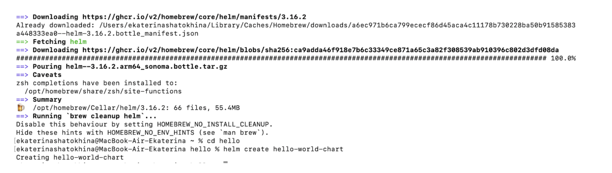
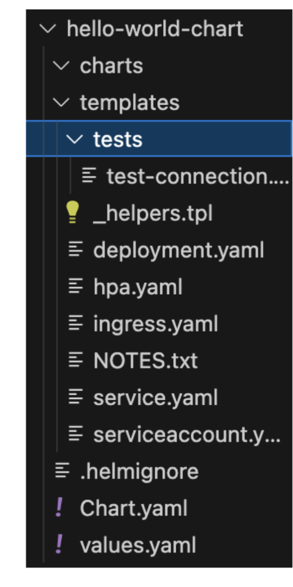
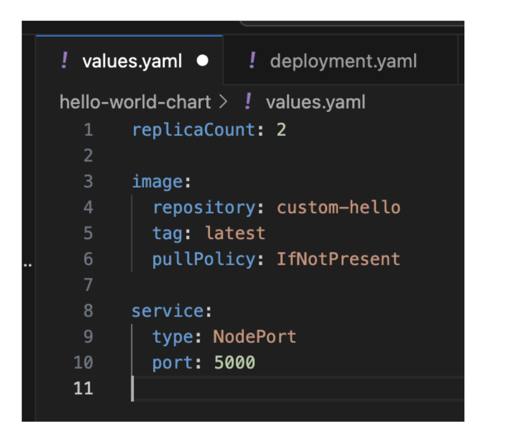
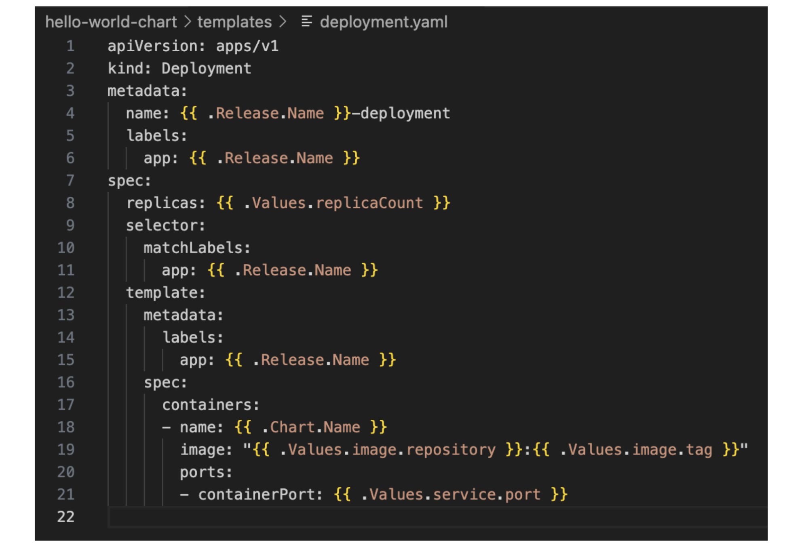
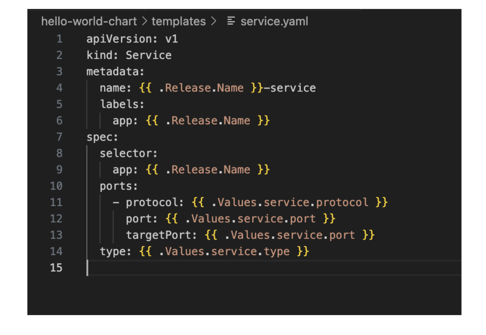
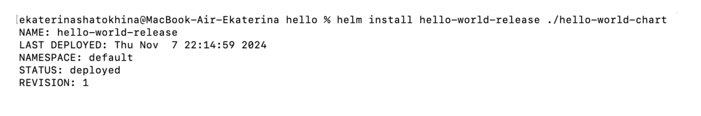
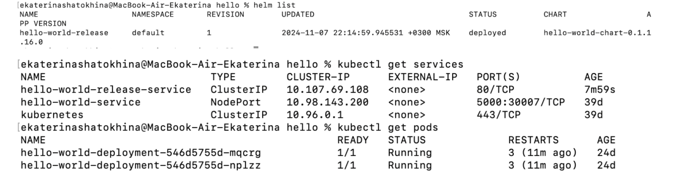
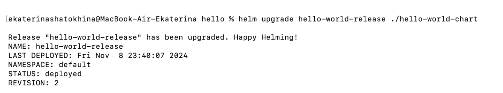
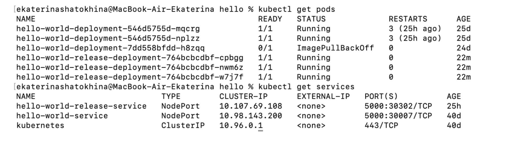

**Лабораторная работа 3**  
Со звездочкой 

**Цель:**   
Создать helm chart на основе обычной 3 лабы. Задеплоить его в кластер. Поменять что-то в сервисе, задеплоить новую версию при помощи апгрейда релиза. 

**Ход работы**

В предыдущих сериях: Написан kubernetes-кластер, в нём развернут сервис (вывод Hello World в браузере). 

Устанавливаем helm (на маке все просто: brew install helm). Далее создаем helm чарт: helm create hello-world-chart.

Создалась такая структура  

Из важного здесь файл values.yaml. Туда мы впишем все значения “переменных”, которые будем использовать в других файлах.

	Также в deployment и service необходимо вписать названия “переменных”, чтобы использовать значения из values. 

Далее нужно развернуть Helm Chart в кластер. Запускаем команду деплоя (здесь hello-world-release \- имя релиза, здесь /hello-world-chart \- имя директории).

С помощью команд helm list, kubectl get services, kubectl get pods проверяем, запущен ли кластер.    

	Далее внесем изменения в файл values.yaml, изменив количество реплик с 2 на 3\. Обновляем релиз.  

	Проверяем kubectl get services, kubectl get pods.   

Проверяем работоспособность. Успех\!

**Топ-3 причины почему helm лучше, чем деплой через kubernetes манифесты:**

1. Управление версиями и откат: Helm позволяет легко обновлять и откатываться к предыдущим версиям приложения, что не так просто с обычными манифестами Kubernetes.  
2. Helm поддерживает стратегию "канареечных развертываний" и поэтапных обновлений, что позволяет развертывать новую версию приложения безопасно и постепенно. Это даёт возможность тестировать изменения на небольшой части трафика, а при необходимости легко откатывать обновления.   
3. Использование переменных: Если нужно что-то поменять в кластере, достаточно просто поменять переменную в values.

	  

