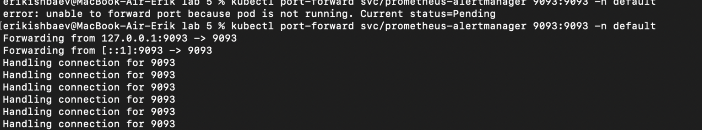
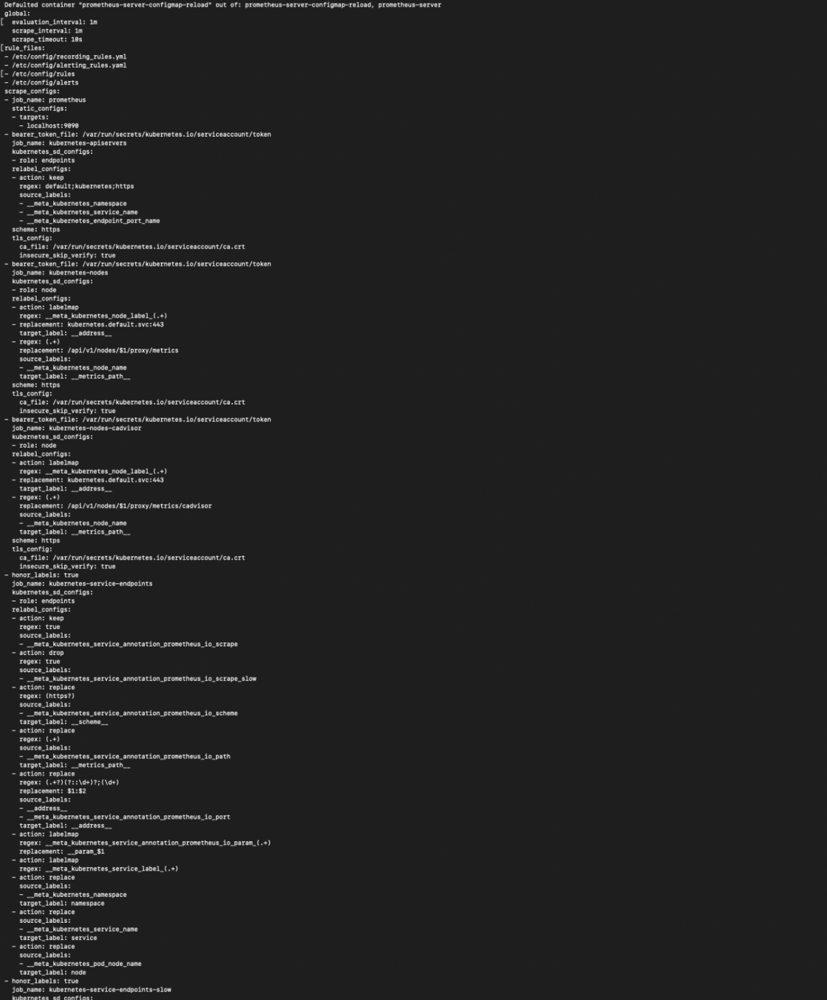
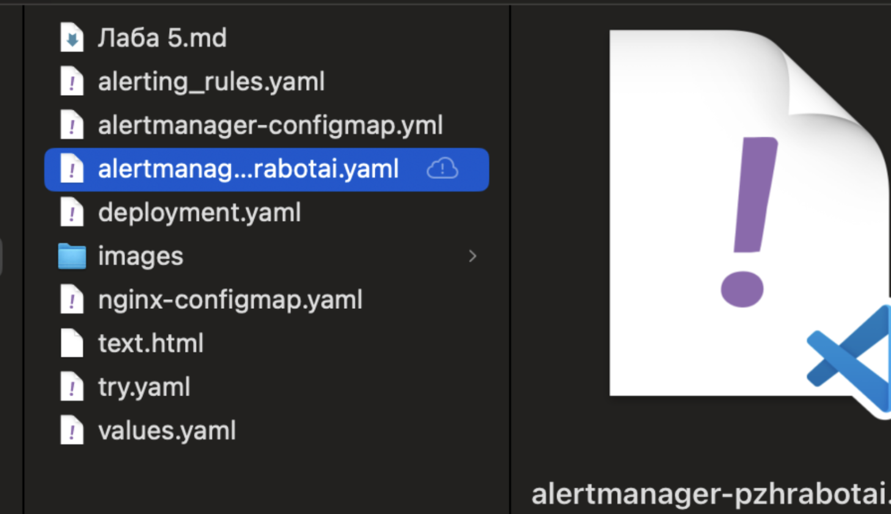
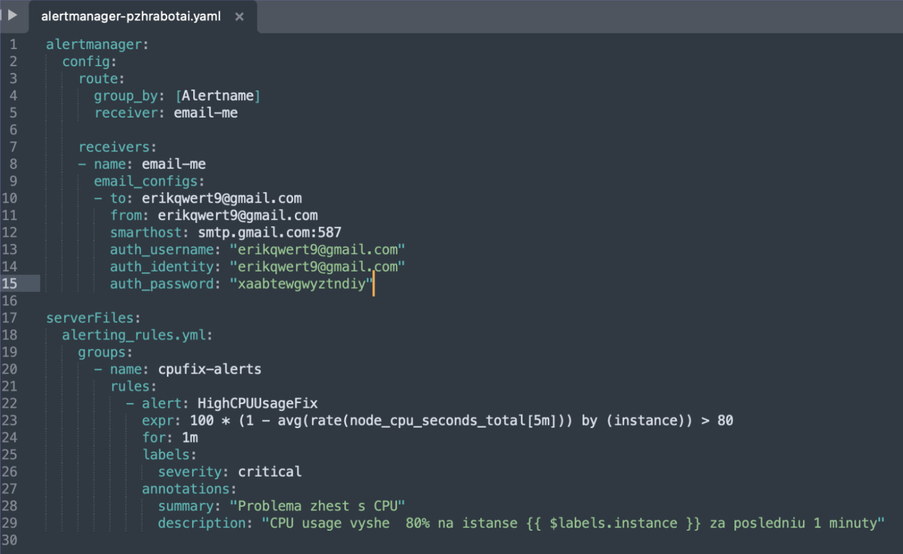
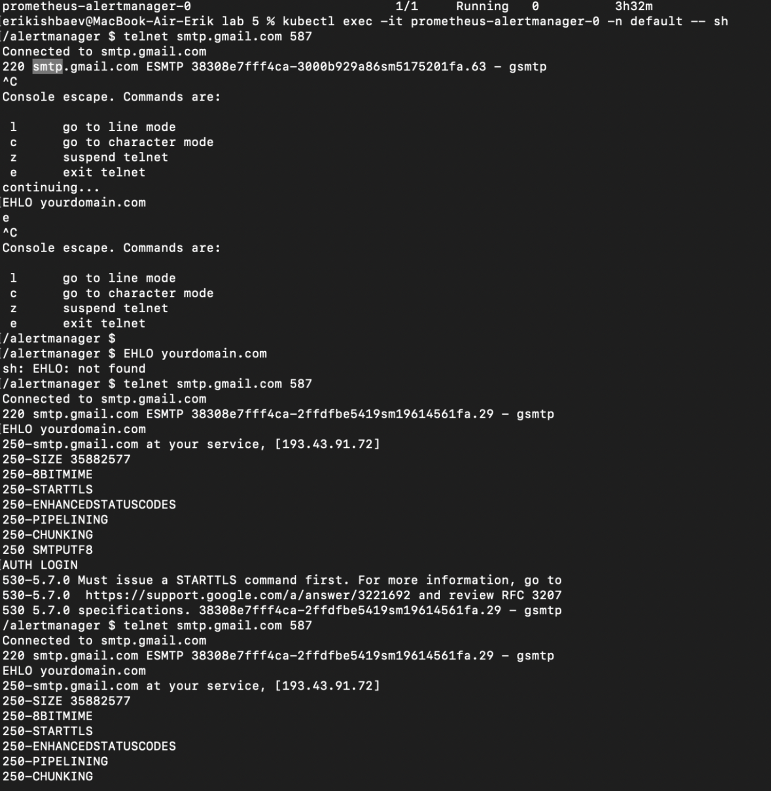
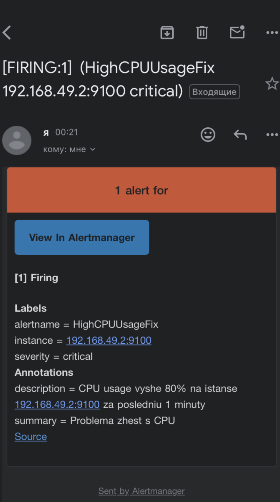
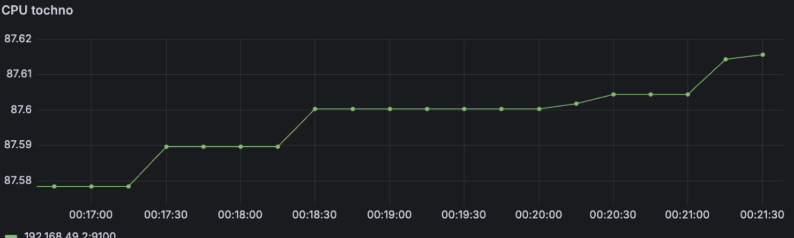

**Что делали?**  
Алерты на почту, если нам какие-то метрики об этом сигналят

**Как это было?**  
****

**А теперь подробнее:**  
Начнем повествование о ~~ночи,проведенной в корпусе на Ломоносова д.9~~    8 часах чиииистого удовольствия с момента, на котором я остановился, а именно на поднятых дашбордах в графане. После этого были выполнены port-forward на promeheus-alert на порт 9093\.   

Спойлер \- особо не пригодилось.   
Дальше я начал увлекательное путешествие в изучение того, что вообще нужно для алерта. Глобально можно выделить 2 пункта:

* Правило. Нужно его описать, чтобы понять, когда вообще нужно о чем-то уведомлять смотрящего за сервером экей девопса.  
* Метод отправки. Тут было предложено 2 варианта, тг бот или почта, я выбрал второе, так как почта казалась проще.  
  Сейчас смотря на пройденный путь все кажется довольно простым, но я застрял на том, что и в какие конфиги подгружается. Я прописал правило для того, чтобы уведомление отправлялось при нагрузке на CPU больше 80 процентов в течение минуты, но зачем-то полез менять именно настройки пода prometheus-alert, а именно в его конфиг мап. Далее я полез в файл prometheus.yml, который является конфигом для нашего сервера, чтобы добавить его в правила. Сам конфиг содержал тонну непонятных строчек, поэтому я просто тыкался и пытался понять, как заставить это все работать.  
    
    
  На фотографии выше то как выглядит конфигурационный файл. Я постоянно допускал ошибки в том, куда именно прописывать правила, пытался менять сами правила и ошибался в отступах, путался в названиях файлов, которые сам насоздавал (фото ниже), путал расширения yaml и yml, из\-за чего файлы не подгружались.

    

В какой-то момент ничего работало и вот я сижу в 4:17 вот так:  
    

**КАК ВСЕ РЕШИЛОСЬ**

После этого мне подсказали, что можно использовать helm и моя жизнь поделилась на до и после:  

    helm upgrade prometheus prometheus-community/prometheus \-f alertmanager-pzhrabotai.yaml

    

Структуру файла я подсмотрел, каюсь, но я правда понимаю все, что здесь написано\!\! Из того, что не связано с сами кубернетисом, я потыкался в smtp, когда тестировал как это все работает.  

    

Gmail постоянно разрывал соединение, это из интересных наблюдений. В  итоге получилось добиться положительного результата, пока ждал эту минуту \- наблюдал за процессом на графике в графане и скрестил пальцы.

    

Ура победа\!

    

**ВЫВОД**

Пока я очень-очень долго тыкался в то, что изначально не понимал, начала появляться картинка того, как это работает. То есть возникающие трудности побуждали больше искать, читать, гуглить и разбираться в вопросе, спасибо вам за это\! Правда тут хочется оставить слова благодарности за курс и задания к нему, это правда было полезно и интересно. Удачи в дальнейшем преподавании, надеюсь в будущем на направлении станет больше таких курсов и они будут появляться в программе как можно  раньше, прям с первых годов обучения.  

    

