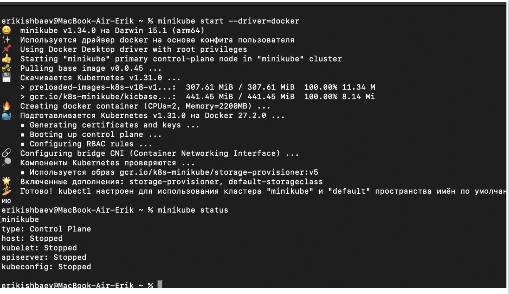
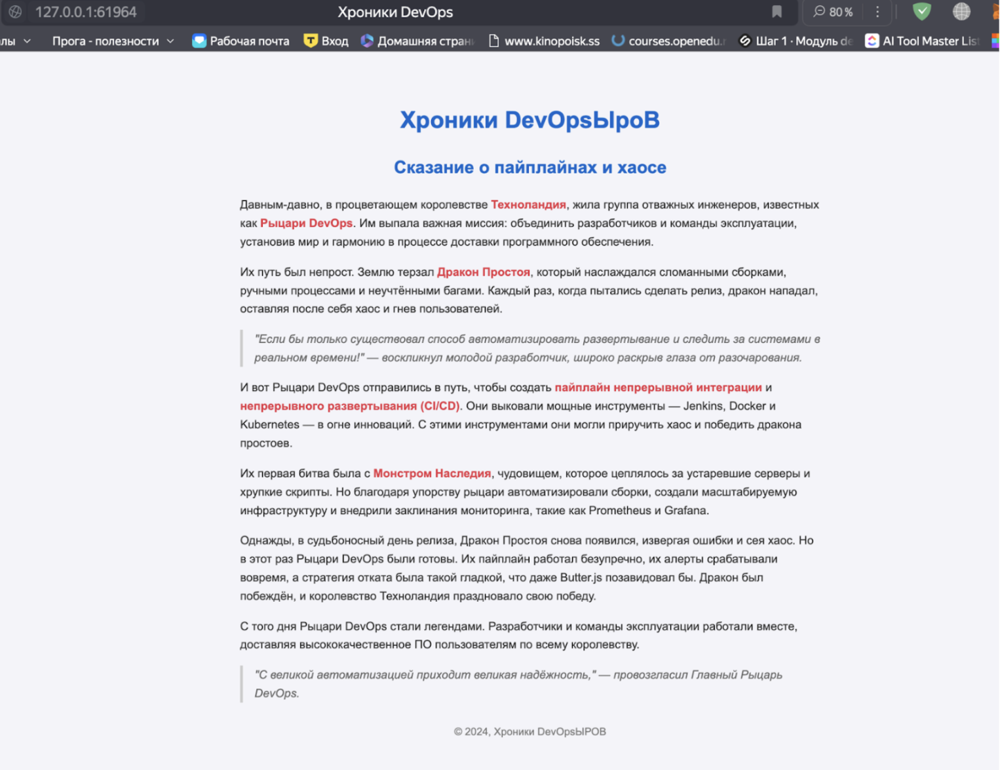
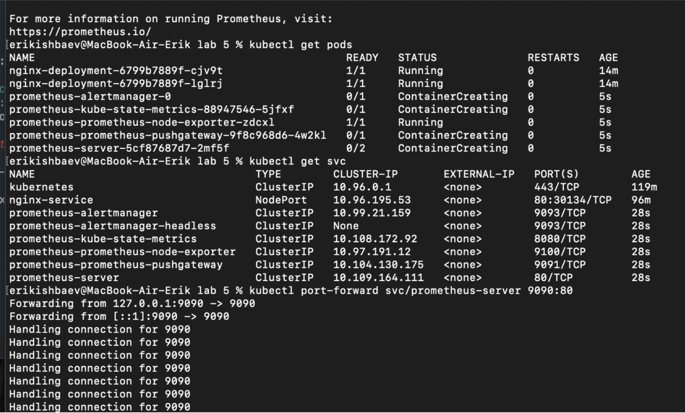
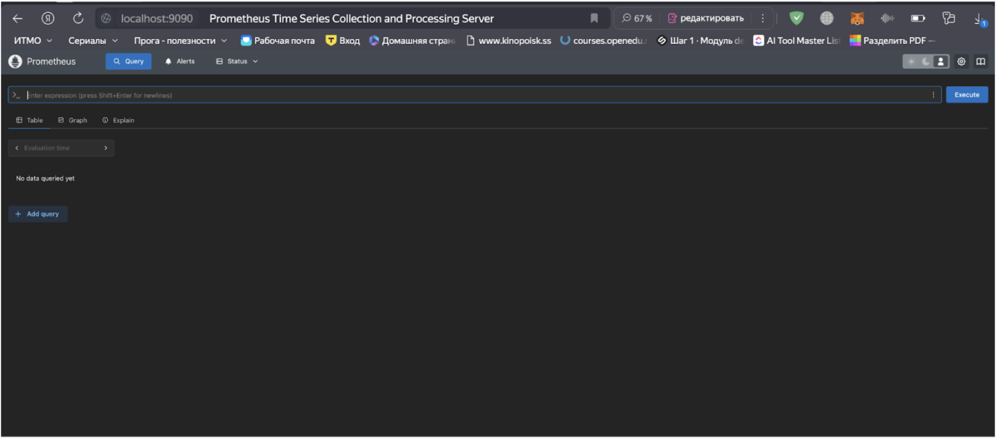
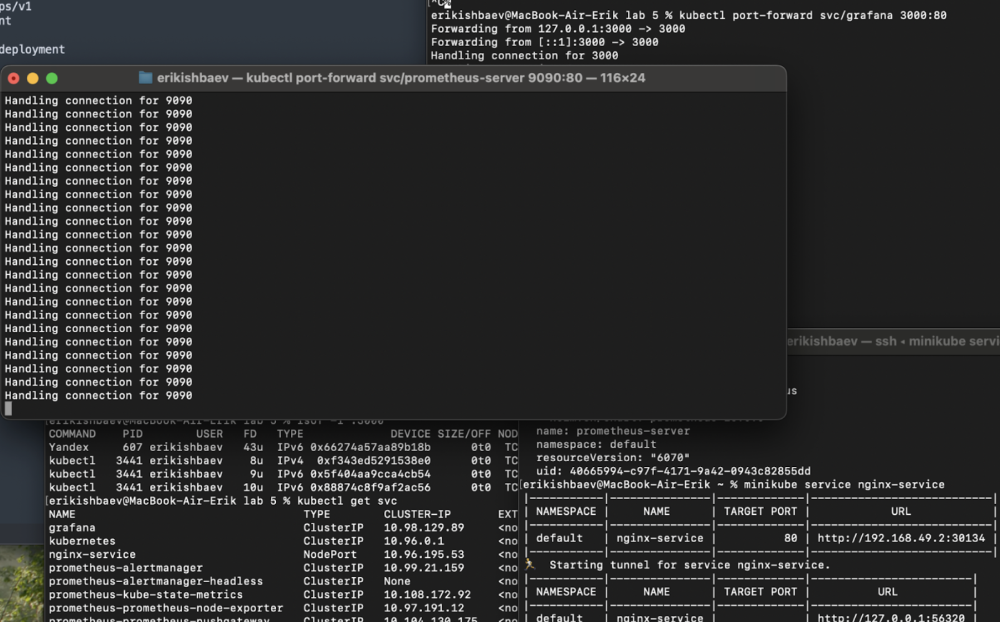
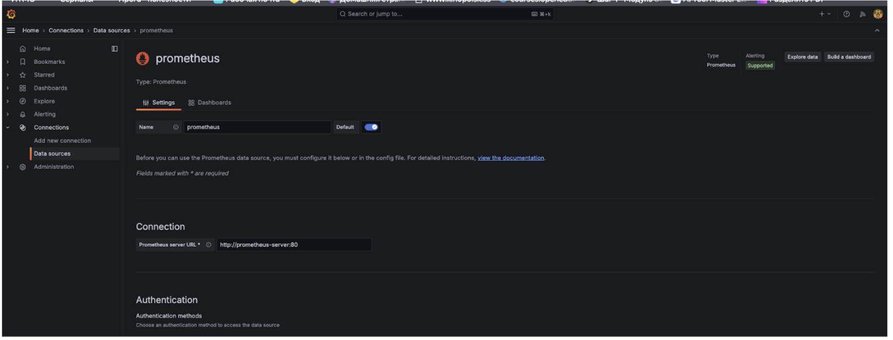
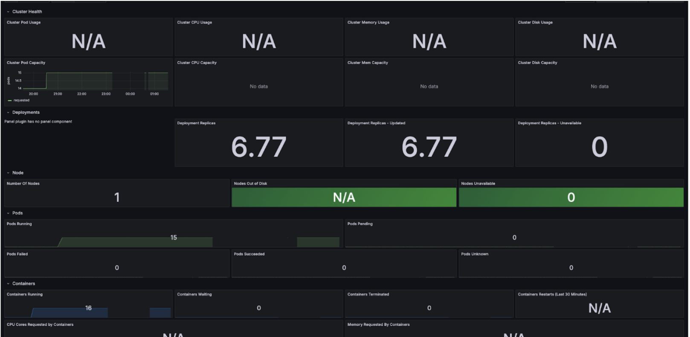
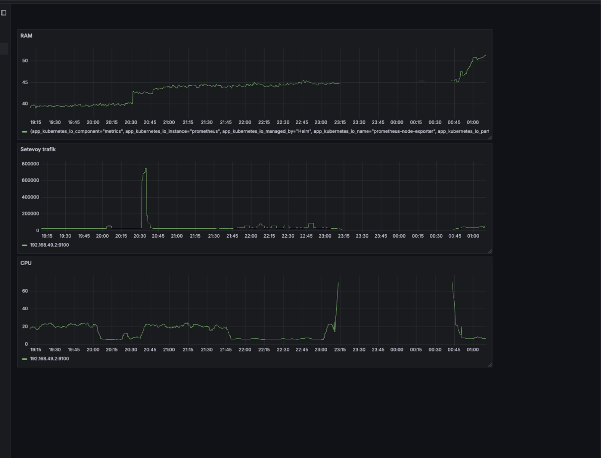

Решил я значит взять 5 лабу, потому что увидел Graphana(у),которая мне нужна будет на производственной практике, а там оказывается надо еще предварительно сделать третью, поэтому лесгоооу.  
Разворачиваем минукуб через докер.  

После долгих танцев с бубном получилось развернуть страничку на nginx, html и содержание страницы для экономии времени было сгенерировано нейро~~удочкой~~сетью.  
  
Далее установим прометеус с помощью homebrew, проверим, что она установилась нормально. Прометеус используется для сбора, хранения и анализа данных о состоянии вашей системы, графана \- для визуализации. Homebrew \- пакетный менеджер, который используется для установки всяких разных айтишных и не только программ через терминал.   

Вроде даже работает на порте 9090, мы делаем так называемый port-forward, чтобы прометеус можно было открыть в браузере.  

Далее была установлена графана также через homebrew. Если честно, то на этом моменте я увлекся и не успел заметить, как у меня уже открыто 3 терминала и прогресс в лабе ушел дальше скринов, поэтому словам о том, что у меня установилось все с помощью команд в homebrew предлагаю наслово\!  
Аналогичными действиями пробрасываем графану на порт 3000 и вот у нас уже пашут 2 терминала, в которых фоном идут логи графаны и прометеуса. Но для полного счастья нам же нужно, чтобы работала и сама страница на nginx, поэтому еще один терминал отдан под него. По хорошему это можно было запускать в фоне, но я побоялся запутаться и забыть какой-нибудь процесс убить, поэтому был выбран вариант ~~эстетичный~~   с несколькими окнами.  

На фотке выше видно, что сам прометеус запустил несколько процессов, которые периодически ходят в апи кубера за нужными нам метриками. Прометеус молодец\!  
Далее в графане было настроено соединение с прометеусом. Менюшка выглядит примерно так:  

Дальнейшим шагом я уже перешел к самим дашбордам. Так как по учебной программе мы большую часть времени изучали питон, то я воспользовался философией прописанной в PEP20 по поводу того, что “Простое лучше сложного” и импортировал по id готовый шаблон графаны для кубера. Оказывается какие-то умные дяди придумали делать так до того, как я сел за лабу(  

Этого мне показалось недостаточным, поэтому я решил создать свой дашборд и немного потыкаться в интерфейс. В результате были созданы 3 вот таких графика:  

Как можно увидеть по графику, с 23:15 до 00:45 я добирался до дома. Визуализация \- действительно полезная вещь, ведь теперь я знаю, что дорога до дома отнимает у меня 1,5 часа жизни\!  

